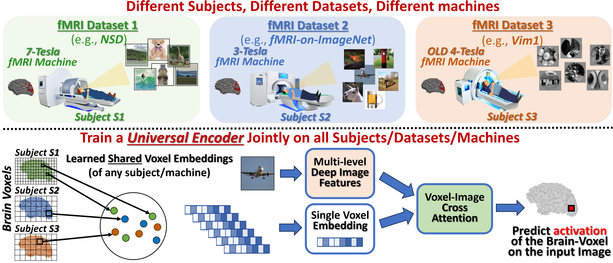

# The Wisdom of a Crowd of Brains: A Universal Brain Encoder

Implementation of:

- **The Wisdom of a Crowd of Brains: A Universal Brain Encoder** — Roman Beliy\*, Navve Wasserman\*, Amit Zalcher, Michal Irani. [arXiv:2406.12179](https://arxiv.org/abs/2406.12179)

  

\* Stands for equal contribution.

## Requirements

Environment requirements are in `env.yml`. To create the conda environment:
```bash
conda env create -f env.yml
conda activate brain-it
```

## Overview

This repository implements the **Universal Brain Encoder** (image-to-fMRI encoding), as described in the paper above.

## Directory Structure
```
├── data/
│   ├── nsd_data/              # NSD dataset files
│   └── scripts/               # Data processing scripts
├── models/                    # Model architectures
├── train/                     # Training scripts
├── train_transfer/            # Transfer learning scripts
├── inference/                 # Encoder inference / prediction
├── utils/                     # Utility functions
└── results/                   # Output directory
    └── saved_models/          # Trained model checkpoints
```

## Data Download

Download NSD stimulus images, fMRI beta maps, and ROI masks for all 8 NSD subjects:
```bash
bash data/scripts/run_all_downloads
```

> **Note:** If you are interested in per-ROI analysis, you can download the relevant ROI masks from [this Google Drive folder](https://drive.google.com/drive/folders/1DUf3nGNNFk6YjRjQtZPfAY5N105GoGJb).

Download the pretrained encoder checkpoint from [Hugging Face](https://huggingface.co/RomanBeliy/Brain-IT):
```bash
python data/scripts/download/download_checkpoints.py
```

This places the encoder checkpoint in `results/saved_models/`.

## Data Preparation

Run all data processing steps:
```bash
bash data/scripts/run_all_data_processing
```

Or run individual steps manually:
```bash
python data/scripts/data_processing/prepare_imgs.py
python data/scripts/data_processing/prepare_fmri.py
```

## Training

Train the Universal Brain Encoder:
```bash
python train/train_encoder.py
```

## Inference

Evaluate the encoder on the shared NSD test set (predictions + voxel correlations):
```bash
python inference/encoder_inference.py
```

Predict fMRI for a custom image array (optional ROI / hemisphere):
```bash
python inference/predict_fmri_for_images.py --images path/to/images.npy --subjects 1 2 5 8
python inference/predict_fmri_for_images.py --images path/to/images.npy --region floc-faces --hemisphere both
```

ROI helpers live in `utils/roi_utils.py`. Region can be `full`, an ROI family (e.g. `floc-faces`), or a single ROI (e.g. `EBA`). Challenge-space ROI masks should be placed under `data/nsd_data/roi_masks/subjXX/roi_masks/` (see the Drive link in Data Download).

## Transfer Learning

To adapt pretrained models to held-out NSD subjects, follow the transfer learning pipeline in [`train_transfer/README.md`](train_transfer/README.md).

## License

This code accompanies the arXiv preprint linked at the top of this README. The PDF is shared under the [license stated on the arXiv record](https://arxiv.org/help/license) (see the “license” icon on the abstract page). If you use this code, please cite the paper. Third-party or vendored code may have its own terms—check the relevant subdirectories.

## Contact

For questions or inquiries: [roman.beliy@weizmann.ac.il](mailto:roman.beliy@weizmann.ac.il).
